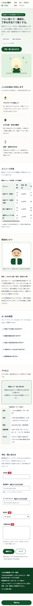
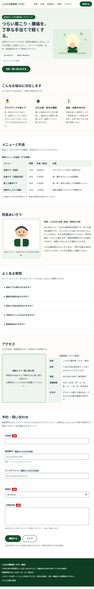
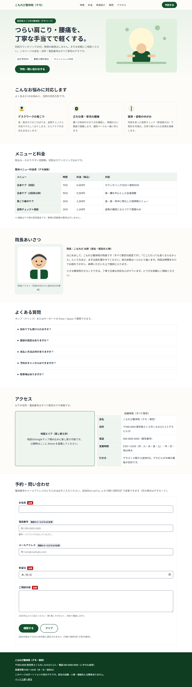

# こもれび整体院（デモLP）

架空の地域ビジネス「こもれび整体院」の1ページLPです。
クラウドソーシングの「店舗・医院のホームページ／LPを作ってほしい」という依頼に対して
「こういう品質で作れます」と見せるためのポートフォリオ用デモです。

**素のHTML/CSS/JavaScriptだけ**で作られており、ビルド工程・フレームワーク・外部CDN・外部フォントは使っていません。
**店名・人名・住所・電話番号・メールアドレスはすべて架空**です（電話は `000-0000-0000`、メールは `example.com`）。

## スクリーンショット

撮影条件：Chrome headless・`--force-device-scale-factor=1`（DPR 1）。
画像の実寸は 375x6608 / 768x4773 / 1280x4557 px です（`node` でPNGヘッダを読んで確認）。

### 375px（スマホ・実寸 375x6608）


### 768px（タブレット・実寸 768x4773）


### 1280px（PC・実寸 1280x4557）


## フォルダ構成

```text
.
├── index.html            # LP本体（全8セクション・JSON-LD2種を含む）
├── config.js             # 送信先設定（FORM_ENDPOINT。空＝デモモード）
├── css/
│   └── style.css         # スタイル（レスポンシブ・外部フォントなし）
├── js/
│   ├── validate.js       # DOM非依存の入力チェック（ブラウザとNodeで共用）
│   ├── validate.test.js  # node --test 用テスト（32件）
│   ├── main.test.js      # main.js の送信完了メッセージのテスト（DOMスタブ・4件）
│   └── main.js           # フォーム表示制御（確認画面・送信・エラー表示）
├── docs/
│   └── screenshots/      # 375 / 768 / 1280px のスクリーンショット
├── package.json          # test スクリプトと html-validate（devDependency）
├── .htmlvalidate.json    # html-validate 設定
└── README.md / LICENSE
```

## 動かし方

ビルドは不要です。`index.html` をブラウザで直接開くだけで動きます
（`file://` 直開きでも動作確認済み。ESモジュールを使わず classic script のみのため）。

```sh
npm install   # html-validate を使う場合のみ
npm test      # 入力チェック32件＋送信完了メッセージ4件＝計36件
npx html-validate index.html  # HTML検証（エラー0を確認済み）
```

実行した確認のコマンド（このリポジトリ内で実行）：

```sh
npm test
npx html-validate index.html
git ls-files
git log --pretty="%an <%ae>"
```

スクリーンショットの撮り直し例（Chrome がインストール済みの場合。
DPR=1 にするため `--force-device-scale-factor=1` を付ける。
`--window-size` は最小ウィンドウ幅に丸められるため、正確な幅が必要な場合は
デバイスエミュレーションを使うこと）：

```sh
chrome --headless=new --disable-gpu --force-device-scale-factor=1 \
  --screenshot=docs/screenshots/1280.png --window-size=1280,2400 \
  "file:///<このフォルダの絶対パス>/index.html"
```

## テストの結果

- `npm test`（`node --test js/validate.test.js js/main.test.js`）：**36件すべて通過**（validate 32件＋main 4件。main のテストは最小のDOMスタブで main.js を実行するもので、実ブラウザでの確認は下記とは別）

  （名前4・メール4・電話5・連絡先4・希望日9・内容4・全体2）。
  希望日はローカル暦日比較に統一し、0時台・23時台の境界テスト3件を追加した。
- `npx html-validate index.html`：**エラー0**（終了コード0）。
- 実ブラウザ（Chrome headless・CDP）での動作確認：空送信→各欄エラー表示、
  不正メール・過去日→形式エラー表示、正常入力→確認画面→デモモード完了表示、
  FAQ開閉。コンソールエラーなし。
- スクリーンショット実寸（DPR 1）：375x6608 / 768x4773 / 1280x4557 px（ページ実高さに合わせて2026-10-05に撮り直し）。

## 確認したこと

- 375 / 768 / 1280px のスクリーンショットを目視し、はみ出し・重なり・横スクロールがないことを確認
- スマホ幅（767px以下）で画面下に固定の「予約する」ボタンが表示されること
- 料金表はスマホ幅で横スクロール可能な枠内に収まること
- `FORM_ENDPOINT` が空のとき送信せず確認画面＋完了メッセージになること
- `details` によるFAQがマウス・キーボード（Enter/Space）で開閉できること
- JS無効時は送信ボタンが出ずURLに個人情報が載らないこと（`noscript` 案内表示）

## 今回直した点（レビュー指摘対応）

- 未追跡の `NUL` ファイルを削除した（Windows予約名）。
- 確認画面と送信内容のずれ対策：確認後に入力が変わったら確認状態を破棄、確認中は入力欄を読み取り専用、送信直前に再チェック、フォームクリアで確認状態を破棄。
- 過去日判定をブラウザのローカル暦日（年・月・日）に統一し、`main.js` と同じ基準にした。境界テスト3件を追加（32件化）。
- JS無効時の個人情報漏えい対策：`form method="post"`＋デモ用空actionをやめ、JSなしでは送信ボタンを出さず `<noscript>` 案内にする。
- アクセシビリティ：料金表ラッパーに `tabindex="0"`・`role="region"`・`aria-label`、共通エラー `error-contact` を電話・メール両方の `aria-describedby` に含める、フォーカスリングを3:1以上の二重リングに。
- スクリーンショットを DPR=1（`--force-device-scale-factor=1`）で撮り直し、実寸 375x6608 / 768x4773 / 1280x4557 を確認して記載した。
- READMEに実行コマンド・撮影条件（DPR・実寸）・未確認事項を明記した。

## できていないこと（正直に・未確認は未確認と書く）

- 送信先が未設定のため、実際の予約受付はできない（`config.js` の `FORM_ENDPOINT` に
  実エンドポイントを設定すれば `fetch` で POST 送信する実装は入っているが、
  実サーバー相手の送受信は**未確認**）。
- 地図は埋め込みではなく差し替え枠のみ（公開時に Googleマップの `iframe` を設置する想定。地図表示は**未確認**）。
- OGP画像（`og:image`）は用意していない（ダミーURLの住所・店舗情報のみ。SNSプレビューは**未確認**）。
- 実機（iPhone / Android）での確認は**未確認**。Chrome のデバイスエミュレーションのみ確認した。
- `js/validate.js` は `file://` 直開き対応のため `import`/`export` 構文を使わず
  `window.AppValidate` 経由で共有している（Node テストでは ESM として副作用import）。
  将来 HTTP 配信が前提になるなら ESM の `export` 形式に戻す余地がある。
- スクリーンショット撮影用の一時スクリプトは削除済み（再撮影時は上記コマンド参照）。
  フルページ高さ（6608 / 4773 / 4557px）のため、実機スクロール時の追従挙動は**未確認**。

## ライセンス

MIT（著作者: `deskloom`）。詳しくは [LICENSE](LICENSE) を参照。
